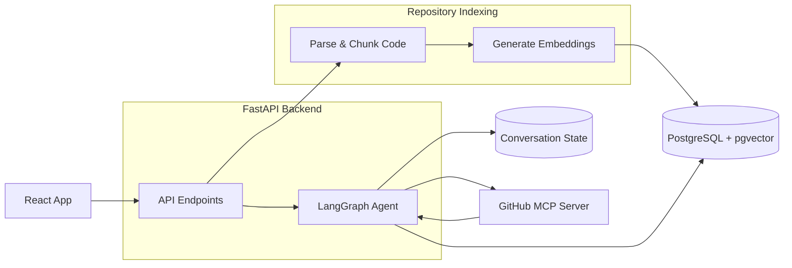

# Repo-Intel — Repository Intelligence Platform

> An agentic AI backend that **understands your codebase**. Point it at any GitHub repository, and it indexes, semantically searches, reviews PRs, diagnoses issues, and generates architecture documentation — all driven by a stateful multi-agent LangGraph pipeline.
> Understanding unfamiliar codebases is slow and expensive. Repo-Intel eliminates that friction by treating your entire repository as a queryable knowledge base. Instead of reading files manually, you ask questions, get answers grounded in the actual code, and receive automated PR/issue analysis — all through a single FastAPI-powered agentic backend.

---
## Video Demo

https://github.com/user-attachments/assets/28b877c9-f15a-437f-a6da-90d9655914b1

> Covers: repository registration, AST indexing, semantic chat, PR review via GitHub MCP, and issue diagnostics.*
-------

## Tech Stack

| Layer | Technology |
|---|---|
| **Agent Orchestration** | LangGraph (stateful multi-agent graph with tool nodes) |
| **API** | FastAPI (async, REST + Server-Sent Events streaming) |
| **GitHub Integration** | GitHub MCP (Model Context Protocol tool server) |
| **Code Indexing** | Tree-sitter AST parser → pgvector cosine similarity |
| **LLM Inference** | Groq API — LLaMA 3.3 70B / LLaMA 3.1 8B (circular fallback) |
| **Embeddings** | HuggingFace `BAAI/bge-small-en-v1.5` via HF Inference Endpoints |
| **Database** | PostgreSQL + pgvector extension (SQLModel / Alembic) |
| **Observability** | structlog, Prometheus metrics, Langfuse tracing |

---

## System Architecture & Information Flow

At a high level, the system consists of three main components:

1. **AST & Embedding Pipeline**: When a repository is registered, it is cloned locally. Tree-sitter extracts functional code symbols (functions, classes, methods), which are then embedded via HuggingFace and indexed inside PostgreSQL using `pgvector` for semantic search.
2. **Stateful Agent Graph (LangGraph)**: The chat system is orchestrated as a stateful graph. On each user message, the graph triggers the LLM (Groq) which can repeatedly call the semantic search tool to pull relevant code chunks until it has sufficient context to answer.
3. **MCP Tool Integrations**: Pull request reviews and issue diagnostics leverage GitHub MCP tool servers to retrieve live diffs and issue bodies directly, feeding them into the LangGraph loop for analysis.


---

## Core Capabilities

### 🤖 Agentic Chat with Codebase Semantic Search
A stateful LangGraph agent graph handles every chat turn. The agent autonomously decides when to call `pgvector_search_tool` to retrieve relevant code chunks via cosine similarity, then synthesises a grounded answer. Conversation state is persisted per session in PostgreSQL via the LangGraph checkpointer.

### 🔍 AST-Powered Code Indexing
Tree-sitter parses repositories into typed symbols (classes, functions, methods). Each symbol is embedded with `BAAI/bge-small-en-v1.5` and stored in pgvector — enabling fast sub-10ms semantic search at query time.

### 🔗 GitHub MCP Integration
Pull request diffs and issue bodies are fetched live via the GitHub Model Context Protocol (MCP) tool server, then fed into the LLM for automated architectural review and root-cause diagnosis.

### 📄 Architecture Documentation Generation
Triggers an LLM pass over indexed code chunks to produce a structured system specification blueprint.
---

## Setup

### Prerequisites

- Python 3.12+
- Node.js 18+
- PostgreSQL with `pgvector` extension **or** Docker

### 1. Clone & configure environment

```bash
git clone https://github.com/SaudQ19/Repo-Intel.git
cd Repo-Intel
cp .env.example .env.development
```

Populate `.env.development` with:

```env
GROQ_API_KEY=          # LLaMA 3.3 inference via Groq
HF_TOKEN=              # HuggingFace embeddings
GITHUB_PERSONAL_ACCESS_TOKEN=   # GitHub MCP — PR/Issue access
```

### 2. Install dependencies & run database migrations

```bash
make install
make migrate
```

### 3. Start the backend & frontend

```bash
make dev            # FastAPI backend  → :8000
make frontend-dev   # React/Vite SPA   → :5173
```

### 4. (Optional) Full stack via Docker

```bash
docker compose up --build
```

---

## Available Commands

| Command | Description |
|---|---|
| `make install` | Install Python deps (`uv sync`) + pre-commit hooks |
| `make dev` | Start FastAPI with hot reload |
| `make frontend-dev` | Start Vite dev server |
| `make check` | Ruff lint + Pyright typecheck |
| `make migrate` | Run Alembic database migrations |
